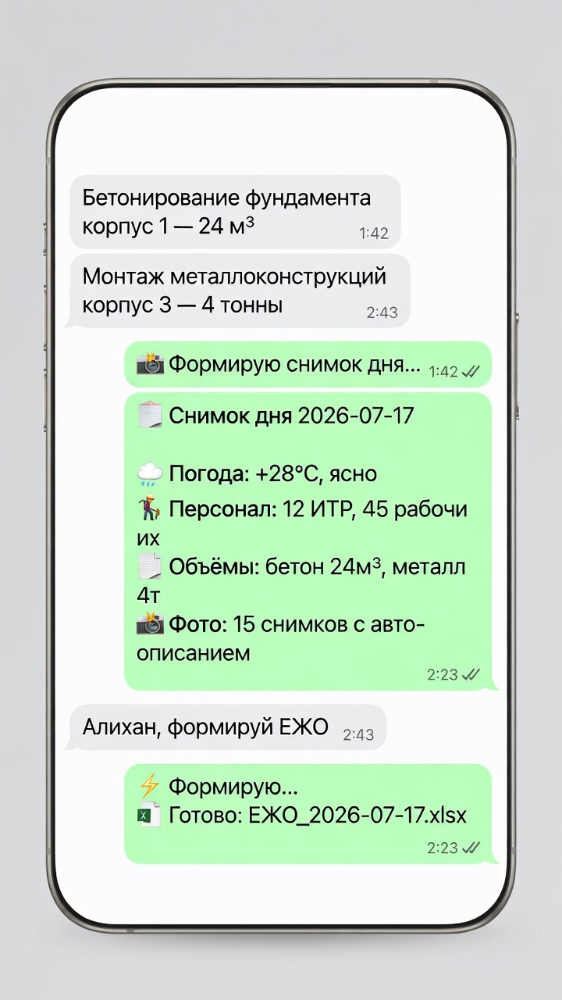
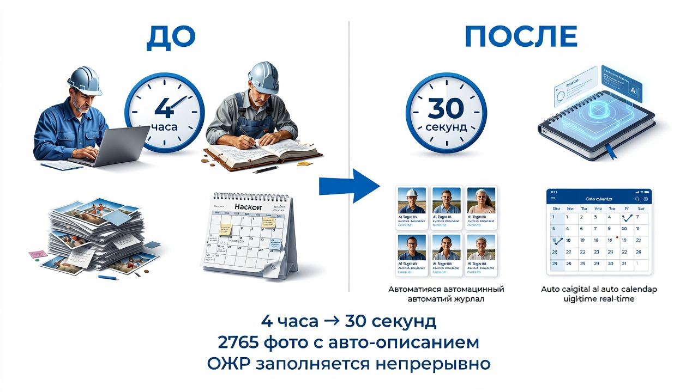
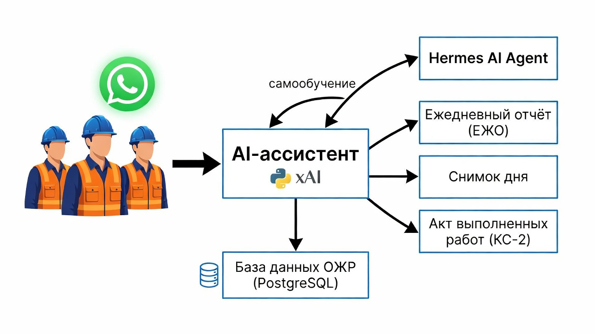
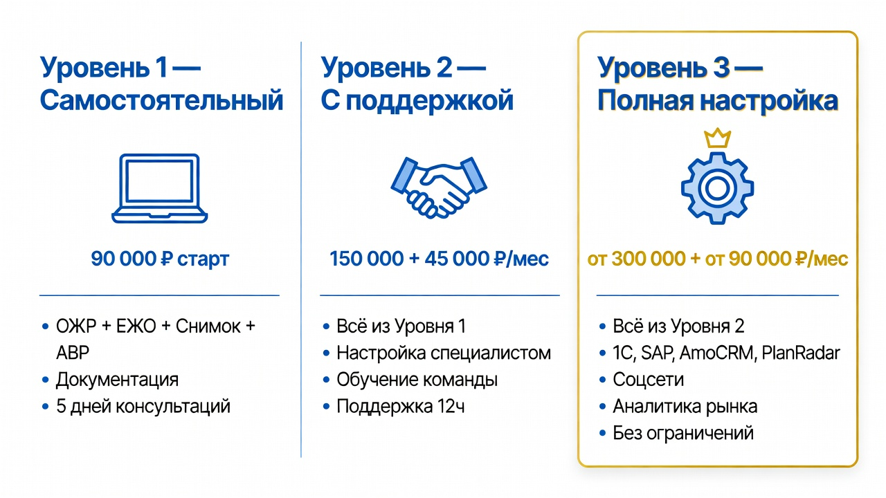

# AI-ассистент заберёт вашу рутину

> **Чтобы освободить время для стратегических решений.**

---

## Проблема

Ваш объект — это живой организм. Массив данных, который меняется каждую минуту. Сотрудники тратят часы на заполнение журналов и отчётов, но полной картины всё равно нет.

Вам нужно знать:
- какая сумма фактического выполнения на сегодня
- сколько осталось выполнить в деньгах и физических объёмах
- отставание от графика СМР
- численность персонала на объекте
- количество предписаний заказчика

Без структуры данные есть, а картины — нет.

---

## Что изменится

Прорабы как обычно отчитываются в чат о выполнении СМР. AI-ассистент:

- формирует ежедневный отчёт
- непрерывно ведёт общий журнал работ
- считает сумму фактического выполнения
- в любой момент готов дать отчёт по запросу

Он структурирует всё, что попадает в чат: фото, документы, сообщения, цифры. Без участия человека.

---

## Дальше — больше

Строительный пакет — это только начало. AI-ассистент работает с любыми потоками данных.

Что ещё он может взять на себя:
- интеграция с 1С, SAP, Битрикс24 — финансы и сметы сами попадают в отчёты
- работа с почтой и документами — входящие автоматически оцифрованы и разобраны
- управление соцсетями и каналами — контент, публикации, аналитика
- мониторинг рынка и конкурентов — ежедневная сводка без ручного сбора
- кадровый учёт — кто на объекте, кто в отпуске, кто на больничном

AI-ассистент — это платформа. Вы начинаете со стройки. Когда будете готовы — подключаете следующие направления. Без новых сотрудников.



---

## Реальный объект: ТЗРК Джеруй

**Кыргызстан, горы.** Золоторудное месторождение. Общежитие на 223 места плюс административно-бытовой корпус. До 35 сотрудников единовременно.

Подключили Алихан. Через две недели:

| | Было | Стало |
|:---|:---|:---|
| Время на ЕЖО | 1 час | **30 секунд** |
| ОЖР | 1 час | **Заполняется непрерывно, весь день** |
| Каталогизация фото | 20 минут | **Автоматически, без участия** |
| Снимок дня | Не делали | **По запросу в любое время — AI-ассистент даже ночью** |



**Результат:** 4 266 сообщений обработано, 210 документов, 2 786 фото, 14 журналов ОЖР. AI-ассистент следит за графиком СМР и ведёт календарь объекта.

---

## Как это работает

Никаких сложных интерфейсов. Никакого обучения. Сотрудники продолжают общаться в рабочем чате — как привыкли. AI-ассистент собирает и структурирует всю информацию. Зачем? Чтобы руководитель в любой момент мог получить текущее состояние на объекте в виде краткого саммари — не читая сотни сообщений.

Всё, что вы делаете: пишете AI-ассистенту в WhatsApp простыми словами.

> «Алихан, запускай опрос»  
> «Алихан, формируй ЕЖО»  
> «Алихан, снимок дня»

Система читает сообщения, раскладывает факты по таблицам ОЖР, формирует отчёты. В любой момент дня и ночи — AI-ассистент готов дать отчёт.

**Система развивается без остановки работы.** Вы получаете улучшения каждую неделю. Без программистов, без долгих проектов.



---

## Почему нам можно доверять

Не обещания. Цифры с действующей стройки:

| Факт | Цифра |
|:---|---:|
| Действующий объект | ТЗРК Джеруй, Кыргызстан |
| Сотрудников на объекте | до 35 единовременно |
| Фото обработано | 2 786 |
| Сообщений обработано | 4 266 |
| Документов обработано | 210 |
| Таблиц ОЖР по ГОСТ | 14 |

Это не пилот на бумаге. Это работает прямо сейчас.

---

## Сколько это стоит — и когда окупается

```
Зарплата инженера ПТО:           180 000 ₽/мес
Алихан (поддержка):               45 000 ₽/мес
━━━━━━━━━━━━━━━━━━━━━━━━━━━━━━━━━━━━━━━━━
Экономия в месяц:                135 000 ₽
Экономия в год:                1 620 000 ₽
```

**Окупаемость: 1–2 месяца.** Дальше — чистая экономия.

---

## Три уровня — выберите свой



### 🚀 «Быстрый старт»

Вы получаете готовую систему и инструкцию. Запускаете сами.

- ОЖР — 14 таблиц по ГОСТ
- ЕЖО — ежедневный отчёт в Excel
- Снимок дня — сводка в WhatsApp
- АВР — акты выполненных работ (КС-2/КС-6)
- WhatsApp-канал для сбора данных с объекта

**90 000 ₽** — разово. Система ваша навсегда.

---

### ⭐ «Под ключ»

Всё из «Быстрого старта» плюс мы настраиваем и сопровождаем.

- Настройка под ваш объект
- Обучение команды
- Поддержка в течение 12 часов
- Ежемесячная оптимизация

**150 000 ₽** — запуск. **45 000 ₽/мес** — поддержка.

---

### 🏢 «Полная настройка»

Для компаний с несколькими объектами и своей IT-инфраструктурой.

- Полная интеграция: 1С, SAP, AmoCRM, PlanRadar
- Работа с почтой и документами
- Автоматический анализ рынка
- Неограниченная кастомизация

**От 300 000 ₽** — запуск. **От 90 000 ₽/мес** — поддержка.

---

## Как начать

```
Неделя 1:  Данные объекта → Настройка → Привязка к WhatsApp
Неделя 2:  Тестирование → Обучение команды → Запуск
```

**Через 2 недели Алихан работает на вашем объекте.**

Без долгих проектов. Без армии консультантов. Вы ставите задачу — мы делаем.

---

## Ответы на важные вопросы

**— Что если интернет пропадёт?**

Система на сервере, данные не теряются. WhatsApp сам доставит сообщения, когда связь восстановится. Ни одного пропущенного факта.

**— Где мои данные?**

На вашем сервере или нашем выделенном. Вы — владелец. Никаких сторонних облаков. Полная выгрузка в любой момент.

**— Что если система ошибётся?**

Все данные проходят проверку. Система не принимает решений за людей — только структурирует и показывает. Вы всегда видите, что и откуда взялось.

**— Можно ли отключить?**

В любой момент. Все данные остаются у вас. Никакой блокировки, никакой привязки.

**— Это надёжно?**

Да. И вот почему:
- ✅ работает на действующей стройке с июня 2026 без перерывов
- ✅ 4 266 сообщений обработано — ноль потерянных
- ✅ 14 таблиц ОЖР по ГОСТ — данные не в мессенджере, а в базе
- ✅ ежедневное резервное копирование
- ✅ автоматический мониторинг 24/7 — вы узнаете о проблеме раньше, чем она повлияет на работу

---

## Построено на передовой платформе Nous Research

AI-ассистент построен на Hermes Agent от Nous Research. Июль 2026. Прямо сейчас Nous Research привлекает $75 миллионов при оценке $1,5 миллиарда. В сделке — Robot Ventures, Union Square Ventures и другие ведущие фонды Кремниевой долины. TechCrunch назвал Hermes «прямым конкурентом ведущих AI-агентов мира».

**Мы не просто пользователи. Мы — часть ядра.**

Мы работаем с Nous Research напрямую. Наши наработки влияют на развитие платформы. Вы — в контакте с разработчиками технологии мирового уровня, через нас. Без посредников. Без наценок.

Это не коробочный софт. Это агентная инженерия на пике своего развития. Архитектура автономного принятия решений, мультиагентная оркестрация, continuous self-improvement — то, что ещё вчера было уделом исследовательских лабораторий, сегодня работает на вашем объекте. Вы не догоняете рынок. Вы его опережаете.

---

## Запустим пилот на одном объекте за 2 недели

Покажем результат. Без обязательств.

Не надо верить на слово. Проверьте на своей стройке.

> 📧 Email: gromyko.ss@icloud.com
> 💬 Telegram: +79218974453
> 📱 WhatsApp: +79218974453

---

*Июль 2026 · Проверено на ТЗРК Джеруй · [Подробное руководство — в CLIENT_GUIDE.md](CLIENT_GUIDE.md)*
