# ОЖР — ER-диаграмма базы данных

> ГОСТ РД-11-05-2007 / Приказ Минстроя РФ №1026/пр от 02.12.2022
> Проект: ТЗРК Джеруй (Alikhan WhatsApp Bot)
> Версия схемы: 1.0.0 | 2026-07-18

## ER Diagram (Mermaid)

```mermaid
erDiagram
    %% ===== ТИТУЛЬНЫЙ ЛИСТ (корень) =====
    ojr_title_page {
        SERIAL    id                  PK "Первичный ключ"
        TEXT      customer_name       "Заказчик: ОсОО Альянс-Алтын"
        TEXT      contractor_name     "Подрядчик: ОсОО АйБиКон"
        TEXT      designer_name       "Проектировщик"
        TEXT      object_name         "Объект: ТЗРК Джеруй"
        TEXT      contract_number     "Номер договора"
        DATE      work_start_date     "Начало работ"
        DATE      work_end_date       "Окончание (план)"
        BOOLEAN   is_active           "Только 1 активный"
    }

    %% ===== РАЗДЕЛ 1: ИТР-ПЕРСОНАЛ =====
    ojr_section1_personnel {
        SERIAL    id                  PK
        INTEGER   title_id            FK "→ ojr_title_page"
        TEXT      organization_type   "customer|contractor|sub|designer"
        TEXT      organization_name   "АйБиКон, Атантай, Майкадам"
        TEXT      full_name           "ФИО"
        TEXT      position            "Должность"
        DATE      start_date          "Дата начала"
        DATE      end_date            "Дата окончания"
        BOOLEAN   is_responsible      "Ответственный производитель"
        TEXT      sync_source         "qa|manual|timesheet"
        BOOLEAN   is_active
    }

    %% ===== РАЗДЕЛ 2: АВТОРСКИЙ НАДЗОР =====
    ojr_section2_design_supervision {
        SERIAL    id                  PK
        INTEGER   title_id            FK
        TEXT      organization_name   "Проектная организация"
        TEXT      responsible_name    "Ответственный"
        TEXT      certificate_number  "Сертификат/приказ"
        JSONB     deputies            "Заместители [{}]"
        BOOLEAN   is_active
    }

    ojr_section2_visits {
        SERIAL    id                  PK
        INTEGER   supervision_id      FK "→ design_supervision"
        DATE      visit_date          "Дата посещения"
        TEXT      inspector_name      "Проверяющий"
        TEXT      findings            "Замечания"
        TEXT      recommendations     "Рекомендации"
        DATE      resolution_date     "Срок устранения"
        BOOLEAN   is_resolved
    }

    %% ===== РАЗДЕЛ 3: ВЫПОЛНЕНИЕ РАБОТ =====
    ojr_section3_work_log {
        SERIAL    id                  PK
        INTEGER   title_id            FK
        DATE      work_date           "Дата работ"
        TEXT      vor_code            "Код ВОР: 3.3.2"
        TEXT      work_name           "Наименование"
        TEXT      building            "Общежитие|АБК|Галерея|НВ|НК|НТ"
        NUMERIC   volume              "Объём"
        TEXT      unit                "м³|м²|пог.м"
        TEXT      contractor          "Субподрядчик"
        TEXT      category            "объём|план"
        INTEGER   schedule_phase_id   FK "→ bot_schedule_phases"
        INTEGER   source_fact_id      FK "→ bot_memory_facts"
        INTEGER   source_poll_id      FK "→ bot_poll_state"
        TEXT      created_by          "qa|manual|ejo"
    }

    %% ===== РАЗДЕЛ 4: СТРОИТЕЛЬНЫЙ КОНТРОЛЬ =====
    ojr_section4_construction_control {
        SERIAL    id                  PK
        INTEGER   title_id            FK
        TEXT      organization_name   "Организация СК"
        TEXT      responsible_name    "Ответственный"
        TEXT      certificate_number  "Сертификат"
        BOOLEAN   is_active
    }

    ojr_section4_checks {
        SERIAL    id                  PK
        INTEGER   control_id          FK
        DATE      check_date          "Дата проверки"
        TEXT      work_code           "VOR-код"
        TEXT      building            "Здание"
        TEXT      violations          "Нарушения"
        DATE      deadline            "Срок устранения"
        BOOLEAN   is_resolved
    }

    %% ===== РАЗДЕЛ 5: ИСПОЛНИТЕЛЬНАЯ ДОКУМЕНТАЦИЯ =====
    ojr_section5_asbuilt_docs {
        SERIAL    id                  PK
        INTEGER   title_id            FK
        TEXT      doc_type            "акт|протокол|сертификат|журнал"
        TEXT      doc_number          "Номер"
        DATE      doc_date            "Дата"
        TEXT      vor_code            "VOR-код"
        TEXT      building            "Здание"
        TEXT      file_path           "Путь к файлу"
        BIGINT    file_message_id     FK "→ bot_memory_messages"
        TEXT      status              "draft|signed|registered"
    }

    %% ===== РАЗДЕЛ 6: ГОССТРОЙНАДЗОР =====
    ojr_section6_gosstroynadzor {
        SERIAL    id                  PK
        INTEGER   title_id            FK
        TEXT      authority_name      "Орган ГСН"
        DATE      inspection_date     "Дата проверки"
        ENUM      result              "no_violations|violations|order|resolved"
        TEXT      order_number        "Предписание №"
        DATE      order_deadline      "Срок исполнения"
        BOOLEAN   is_order_executed
    }

    %% ===== ПОГОДА =====
    ojr_weather {
        SERIAL    id                  PK
        INTEGER   title_id            FK
        DATE      weather_date        UK "Дата"
        NUMERIC   temp_max            "T°C max"
        NUMERIC   temp_min            "T°C min"
        NUMERIC   precipitation_mm    "Осадки мм"
        NUMERIC   wind_speed          "Ветер м/с"
        ENUM      phenomenon          "clear|rain|snow|..."
        BOOLEAN   is_work_stopped     "Остановка по погоде"
    }

    %% ===== ФОТО-ФИКСАЦИЯ =====
    ojr_photo_log {
        SERIAL    id                  PK
        INTEGER   title_id            FK
        INTEGER   work_log_id         FK "→ work_log (опционально)"
        DATE      photo_date          "Дата фото"
        TEXT      building            "Здание"
        TEXT      file_path           "Путь к файлу"
        BIGINT    file_message_id     FK "→ bot_memory_messages"
        TEXT      caption             "Подпись"
        TEXT      ai_description      "Grok Vision описание"
        INTEGER   ejo_column          "Колонка в ЕЖО (3|5|10|14|17)"
        INTEGER   ejo_photo_index     "Индекс 1-5"
    }

    %% ===== СВОДНЫЕ =====
    ojr_daily_summary {
        SERIAL    id                  PK
        INTEGER   title_id            FK
        DATE      summary_date        UK
        NUMERIC   total_volume_today  "Объём за день"
        NUMERIC   total_volume_month  "С начала месяца"
        NUMERIC   completion_pct      "% готовности"
        TEXT      ejo_file_path       "Путь к .xlsx"
    }

    %% ===== МАТЕРИАЛЫ + ИНЦИДЕНТЫ =====
    ojr_materials {
        SERIAL    id                  PK
        INTEGER   title_id            FK
        DATE      material_date       "Дата поступления"
        TEXT      material_name       "Наименование"
        NUMERIC   quantity            "Количество"
        TEXT      unit                "Ед.изм."
        TEXT      certificate_number  "Сертификат"
    }

    ojr_incidents {
        SERIAL    id                  PK
        INTEGER   title_id            FK
        DATE      incident_date       "Дата"
        TEXT      incident_type       "accident|tb|equipment|weather"
        TEXT      severity            "minor|major|critical|fatal"
        TEXT      description         "Описание"
        NUMERIC   downtime_hours      "Часы простоя"
    }

    %% ===== СУЩЕСТВУЮЩИЕ ТАБЛИЦЫ (ТОЛЬКО ЧТЕНИЕ) =====
    bot_memory_facts {
        INTEGER   id                  PK
        TEXT      fact                "Текст факта"
        TEXT      category            "Категория"
        DATE      fact_date           "Дата"
        TEXT      building            "Здание"
    }

    bot_memory_messages {
        BIGINT    id                  PK
        TEXT      message_type        "text|image|document"
        JSONB     tags                "Теги (building, description)"
        TEXT      file_name
    }

    bot_schedule_phases {
        INTEGER   id                  PK
        TEXT      code                "Код этапа"
        TEXT      phase_name          "Название"
        DATE      start_date
        DATE      end_date
        TEXT      status              "active|completed|planned"
    }

    bot_poll_state {
        INTEGER   id                  PK
        DATE      poll_date
        TEXT      status              "active|closed"
    }

    %% ===== ОТНОШЕНИЯ =====
    ojr_title_page ||--o{ ojr_section1_personnel : "title_id"
    ojr_title_page ||--o{ ojr_section2_design_supervision : "title_id"
    ojr_title_page ||--o{ ojr_section3_work_log : "title_id"
    ojr_title_page ||--o{ ojr_section4_construction_control : "title_id"
    ojr_title_page ||--o{ ojr_section5_asbuilt_docs : "title_id"
    ojr_title_page ||--o{ ojr_section6_gosstroynadzor : "title_id"
    ojr_title_page ||--o{ ojr_weather : "title_id"
    ojr_title_page ||--o{ ojr_photo_log : "title_id"
    ojr_title_page ||--o{ ojr_daily_summary : "title_id"
    ojr_title_page ||--o{ ojr_materials : "title_id"
    ojr_title_page ||--o{ ojr_incidents : "title_id"

    ojr_section2_design_supervision ||--o{ ojr_section2_visits : "supervision_id"
    ojr_section4_construction_control ||--o{ ojr_section4_checks : "control_id"

    ojr_section3_work_log }o--|| bot_schedule_phases : "schedule_phase_id"
    ojr_section3_work_log }o--|| bot_memory_facts : "source_fact_id"
    ojr_section3_work_log }o--|| bot_poll_state : "source_poll_id"

    ojr_photo_log }o--|| ojr_section3_work_log : "work_log_id"
    ojr_photo_log }o--|| bot_memory_messages : "file_message_id"
    ojr_section5_asbuilt_docs }o--|| bot_memory_messages : "file_message_id"

    ojr_section3_work_log ||--o{ ojr_photo_log : "work_log_id"
```



## Визуальная раскладка (ASCII)

```
┌─────────────────────────────────────────────────────────────────┐
│                     ojr_title_page (1)                          │
│  Заказчик · Подрядчик · Проектировщик · Объект · Договор · ГСН  │
└──────┬──────┬──────┬──────┬──────┬──────┬──────┬──────┬────────┘
       │      │      │      │      │      │      │      │
       ▼      ▼      ▼      ▼      ▼      ▼      ▼      ▼
   ┌──────┐┌────┐┌────┐┌────┐┌────┐┌────┐┌────┐┌────┐┌──────┐
   │Раздел││Р.2 ││Р.3 ││Р.4 ││Р.5 ││Р.6 ││По- ││Фото││Свод- │
   │  1   ││А.Н ││Ра- ││С.К ││И.Д ││ГСН ││года││    ││ные   │
   │Перс. ││    ││боты││    ││    ││    ││    ││    ││      │
   └──────┘└──┬─┘└──┬─┘└──┬─┘└────┘└────┘└────┘└──┬─┘└──────┘
              │     │     │                        │
              ▼     │     │                        │
          ┌──────┐ │     │                        │
          │Visits│ │     │                        │
          └──────┘ │     │    ┌───────────────────┘
                    │     │    │ (file_message_id)
        ┌───────────┼─────┼────┼───────────────────┐
        │           │     │    │                   │
        ▼           ▼     ▼    ▼                   ▼
  ┌───────────┐ ┌─────────────────┐ ┌──────────────────────┐
  │bot_sched  │ │bot_memory_facts │ │bot_memory_messages   │
  │_phases    │ │(source_fact_id) │ │(file_message_id)     │
  └───────────┘ └─────────────────┘ └──────────────────────┘
```

## Ключевые отношения (JOIN paths)

| От | К | Через | Назначение |
|----|----|-------|------------|
| `work_log` | `schedule_phases` | `schedule_phase_id` | Привязка факта к этапу графика |
| `work_log` | `memory_facts` | `source_fact_id` | Трассировка: откуда пришёл объём |
| `work_log` | `poll_state` | `source_poll_id` | Связь с опросом |
| `photo_log` | `memory_messages` | `file_message_id` | Исходное WhatsApp-сообщение с фото |
| `photo_log` | `work_log` | `work_log_id` | Фото привязано к конкретной работе |
| `asbuilt_docs` | `memory_messages` | `file_message_id` | Исходный файл документа |

## Статус таблиц

| Таблица | Строк | Назначение | Частота записи |
|---------|-------|------------|----------------|
| `ojr_title_page` | 1 | Метаданные проекта | Один раз |
| `ojr_section1_personnel` | ~15 | ИТР-персонал | При смене состава |
| `ojr_section2_design_supervision` | 1-2 | Авторский надзор | При смене ответственного |
| `ojr_section2_visits` | ~30/год | Посещения АН | При каждом визите |
| `ojr_section3_work_log` | ~15-50/день | Выполнение работ | Ежедневно |
| `ojr_section4_construction_control` | 1-2 | Стройконтроль | При смене ответственного |
| `ojr_section4_checks` | ~50/год | Проверки СК | При каждой проверке |
| `ojr_section5_asbuilt_docs` | ~200/год | Исполнительная | По мере оформления |
| `ojr_section6_gosstroynadzor` | ~10/год | Госстройнадзор | При проверках |
| `ojr_weather` | 365/год | Погода | Ежедневно (cron) |
| `ojr_photo_log` | ~15/день | Фото-фиксация | Ежедневно |
| `ojr_daily_summary` | 365/год | Сводка дня | Ежедневно (fill_ejo) |
| `ojr_materials` | ~100/год | Материалы | По мере поступления |
| `ojr_incidents` | ~20/год | Инциденты | По факту |
